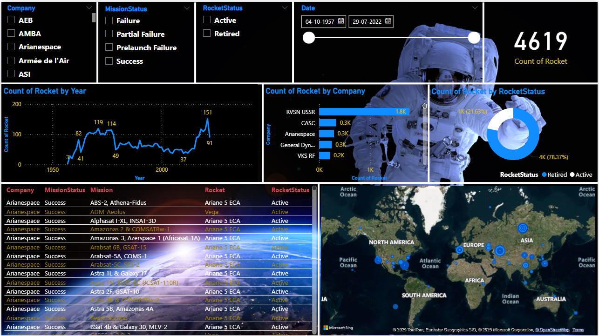

# 🚀 Rocket Launch Analytics Dashboard

⚡ **Microsoft Power BI Dashboard** providing detailed insights on rocket launches worldwide.

---

### 📊 Dashboard Features

- Company-wise rocket launch analysis  
- Mission status overview  
- Rocket status tracking  
- Launch date filtering  
- Count of rockets launched overall  
- Year-wise rocket launch counts  
- Rocket count by company  
- Rocket count by rocket status  

---

### 🖼️ Demo Preview

  

---

## 🔗 Connect With Me

<table>
  <tr>
    <td></td>
    <td>
      <strong>YouTube</strong> 
      <a href="https://www.youtube.com/@Code-With-Vishal" target="_blank">Subscribe to Code With Vishal</a>
    </td>
  </tr>
  <tr>
    <td></td>
    <td>
      <strong>Instagram</strong> 
      <a href="https://www.instagram.com/vishaal_87" target="_blank">Follow me on Instagram</a>
    </td>
  </tr>
</table>
